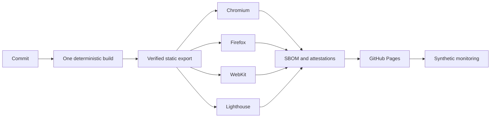

# Operations

## サービス概要

| 項目             | 値                                     |
| ---------------- | -------------------------------------- |
| サービス         | `slithy.net`                           |
| 種別             | GitHub Pages 上の静的サイト            |
| 本番 URL         | `https://slithy.net`                   |
| デプロイ元       | `1.x` ブランチ                         |
| データ永続化     | なし                                   |
| 利用者データ     | 収集しない                             |
| 復旧単位         | 検証済み静的エクスポート               |
| セキュリティ窓口 | GitHub Private Vulnerability Reporting |

`/` は復元した SLITHY.NET、`/sasakiuri/` は個人ページです。個人ページの manifest と Service Worker も `/sasakiuri/`
内に限定し、トップページを制御しません。

## SLI と SLO

可用性の SLI は、6 時間ごとの合成監視で次をすべて満たした割合です。30 日の移動窓で 99% 以上を目標とします。

- トップ、個人ページ、manifest、robots、sitemap、Service Worker、security.txt が HTTP 2xx を返す。
- 各応答を 3,000 ms 以内に読み終える。
- タイトル、画像、連絡先などの本番契約が応答内に存在する。
- TLS 1.2 以上で証明書検証に成功し、有効期限が 14 日以上残っている。

性能 SLO は、ローカル成果物に対する Lighthouse
3 回の中央値で管理します。Performance は 0.95 以上、Accessibility と SEO は 1.00、LCP は 2,500 ms 以下、TBT は 200
ms 以下、CLS は 0.05 以下です。閾値は `config/quality-gates.json` を唯一の定義元とします。

GitHub Actions の schedule は厳密な時刻を保証しないため、この SLO は利用者向けの金銭的 SLA ではなく、運用上の目標です。

## デプロイ

GitHub Pages の `Custom domain` は `slithy.net` に設定します。このリポジトリは GitHub
Actions から配信するため、成果物内の `CNAME` ではなく Pages のリポジトリ設定が定義元です。DNS は次の値へ向けます。

| 種別  | 名前  | 値                    |
| ----- | ----- | --------------------- |
| A     | `@`   | `185.199.108.153`     |
| A     | `@`   | `185.199.109.153`     |
| A     | `@`   | `185.199.110.153`     |
| A     | `@`   | `185.199.111.153`     |
| CNAME | `www` | `sasakiuri.github.io` |

GitHub アカウント側でドメインを検証してから DNS を切り替えます。DNS と Pages の検査が通り、証明書が発行された後に
`Enforce HTTPS` を有効にします。



`quality` job だけが本番成果物をビルドします。file byte の tree digest と、route、metadata、PWA、discovery、asset
graph を含む完全な evidence の seal digest を生成します。`out/` と seal は同じ Actions
artifact に格納し、形式検証済みの seal digest は job
output でも渡します。後続 job は seal を再生成せず、取得した byte と evidence を既存 seal に照合してから、ブラウザー、アクセシビリティ、画像差分、PWA、性能を検査します。SPDX
SBOM は全 file の SHA-1 と SHA-256、package verification code を持ち、公式 SPDX
Tools で検証します。検証済み SBOM の SHA-256 は別経路で deploy
job へ渡し、attestation 直前に再照合します。すべて通過した成果物だけを決定的な tar.gz に梱包し、SLSA provenance と SBOM
attestation を発行してから GitHub Pages へ昇格します。

`release-evidence` には tar.gz、tree と semantic evidence の SHA-256 seal、SPDX
SBOM を 90 日保存します。`gh attestation verify` では、取得した tar.gz がこのリポジトリの GitHub
Actions で生成されたことを検証できます。

```sh
gh attestation verify site-export.tar.gz -R sasakiuri/sasakiuri.github.io
```

## 障害対応

1. `Production monitoring` の JSON、JUnit、job summary で、失敗した endpoint、応答時間、証明書情報を確認します。
2. GitHub Pages Status と `Verify and deploy`
   の直近 run を確認し、配信基盤と成果物のどちらに原因があるかを切り分けます。
3. 成果物起因なら、最後に成功した commit の workflow を再実行します。固定依存と再現可能ビルドにより、同じ SHA-256 tree
   seal を再生成できることが復旧条件です。
4. Service Worker 起因なら、新しい content hash の成果物を配信します。activate 時に旧 `sasakiuri-*`
   cache が削除されます。
5. 復旧後に `Production monitoring` を手動実行し、全 check の成功を確認します。

重大度は、全体停止または TLS 異常を SEV-1、主要機能またはオフライン機能の停止を SEV-2、性能予算超過や単一 metadata 異常を SEV-3 とします。SEV-1 と SEV-2 は、原因、影響時間、検知経路、再発防止策を Issue に残します。脆弱性が関係する場合は公開 Issue を作らず、`SECURITY.md`
の非公開経路を使います。

## 定期作業

- Dependabot の npm、GitHub Actions、Dev Container 更新を週次で確認します。
- `Deep quality` で Mutation Testing と 2 回のクリーンビルド比較を週次実行します。
- `Security` で CodeQL、OSV、Gitleaks、zizmor、ライセンス、SBOM を週次実行します。
- OpenSSF Scorecard を週次実行し、リポジトリ設定を含む supply-chain posture の退行を確認します。
- `security.txt` は有効期限前に更新します。失効した内容は合成監視でも拒否します。
