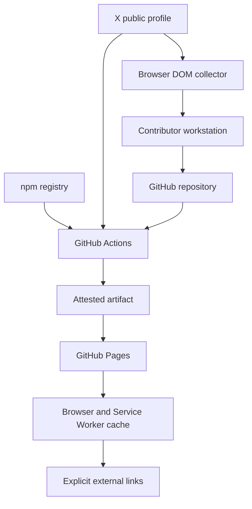

# Threat Model

## 対象と前提

対象は、ソースから GitHub Actions、Actions artifact、GitHub Pages、利用者のブラウザーと Service Worker
cache までです。サイトは認証、サーバーへ送信する入力、動的 API、データベース、利用者追跡を持ちません。日記の検索語は利用者のブラウザー内だけで処理します。外部サイトへのリンクはありますが、第三者の script、style、font、画像は実行時に読み込みません。

保護する資産は、表示内容とデザインの完全性、訪問者に実行される JavaScript、デプロイ権限、依存関係と lockfile、脆弱性報告の機密性、復旧に使う provenance と SBOM です。

## Trust boundary

GitHub repository への merge、npm
registry と X の公開 HTML または描画済み DOM からの取得、手動 JSON の repository への取り込み、Actions の OIDC 署名、Pages への deploy、別 origin への利用者遷移が主要な trust
boundary です。

## STRIDE 分析

| 脅威                   | 例                                                   | 主な対策                                                                 |
| ---------------------- | ---------------------------------------------------- | ------------------------------------------------------------------------ |
| Spoofing               | 偽の配布元や証明書でサイトを装う                     | HTTPS 強制、TLS 合成監視、canonical URL、Sigstore ベースの attestation   |
| Tampering              | build 後に HTML、chunk、契約証跡を差し替える         | build-once promotion、tree／evidence seal、artifact digest、provenance   |
| Repudiation            | 誰が何を配信したか追跡できない                       | Git history、environment deployment、OIDC attestation、90 日の証跡保存   |
| Information disclosure | secret や source map を静的成果物へ混入する          | topology 契約、拡張子拒否、Gitleaks、secret pattern、公開前の検査        |
| Denial of service      | Pages 障害、巨大 asset、壊れた cache                 | 配信量予算、content hash cache、合成監視、再現可能な rollback            |
| Elevation of privilege | 悪意ある Action や install script が権限を取得する   | 最小権限、commit SHA pin、zizmor、allowBuilds、trust policy、CodeQL      |
| Cross-site scripting   | inline script または依存 chunk を注入する            | hash-based CSP、JSON-LD escaping、外部実行 resource 禁止、React escaping |
| Reverse tabnabbing     | 外部リンク先から元ページを操作する                   | `noopener noreferrer` を型付き `ExternalLink` で強制                     |
| Dependency confusion   | registry や transitive URL から別 package を取得する | pnpm lockfile、exact version、exotic subdependency 拒否、OSV、Dependabot |
| Untrusted diary input  | X の HTML や手動 JSON から不正な markup を保存する   | DOM 限定収集、固定 profile、strict JSON、ID／URL 再構成、React escaping  |
| Search index tampering | 欠落や異形式の検索データで誤った内容を表示する       | 同一 origin、固定 path、strict field／件数／順序検証、CSP、成果物 seal   |
| Stale offline content  | Service Worker が脆弱な旧成果物を保持する            | content hash cache、activate 時の旧 cache 削除、network-first navigation |

## Supply chain control

- Node.js、pnpm、直接依存は exact version で固定します。
- pnpm は release 後 24 時間未満の version、trust level が以前より低下した version、未承認 install
  script、transitive な git または tarball dependency を拒否します。
- GitHub Actions は mutable tag ではなく commit SHA で固定し、Dependabot で更新します。
- CodeQL、OSV、Dependency Review、Gitleaks、license allowlist、OpenSSF Scorecard を独立した検知層として使います。
- deploy 対象と attestation 対象は、browser と性能検査を通過した同一 artifact です。quality
  job が作った完全 evidence の seal digest と検証済み SBOM
  digest を別経路で渡し、後続 job は shell へ直接展開せず、seal を書き換えずに file 集合、byte、semantic
  evidence、attestation 対象 SBOM を照合します。

## 残余リスク

GitHub Pages では repository 単位の任意 HTTP response
header を設定できません。このため CSP は HTML の先頭に meta として入り、
`frame-ancestors`、HSTS、Permissions-Policy など header でのみ完全に適用できる制御は Pages 側に依存します。Next.js が出力する inline
style のため `style-src 'unsafe-inline'` も残ります。一方、script は `unsafe-inline` を許可せず、build ごとの SHA-256
hash だけを許可します。

GitHub、npm registry、ブラウザー vendor は外部 trust
anchor です。これらの全面的な侵害は repository 内の制御だけでは防げません。provenance、複数 scanner、合成監視は、侵害範囲の縮小と検知、復旧を目的とします。

外部リンク先の内容と可用性は保証できません。リンクは利用者の明示操作でだけ開き、遷移先に referrer と opener を渡しません。

X の公開 HTML は公式 API 契約ではありません。構造は予告なく変わる可能性があります。抽出に失敗した場合は更新処理を fail
closed にし、既存の日記を上書きしません。取得処理は固定プロフィールの本文と数値 ID だけを採用し、HTML、外部画像、外部 script を成果物へコピーしません。

全件検索用の静的 JSON は、投稿 ID、公開日時、本文だけを公開し、元投稿 URL は含めません。全件テキスト版も日時と本文だけから生成します。両方を成果物の形式、配信量、完全性 seal、合成監視の対象にします。ブラウザーは固定した同一オリジンの JSON パスからだけ読み込み、version、全件数、未知のフィールド、ID、日時、本文、重複、降順を検証します。不正または取得失敗なら全件検索を有効にせず、サーバー生成済みの最新50件と年別ページを残します。利用者が明示的に再読み込みした場合だけ同じ固定パスへ再試行します。検索語は最大100文字で、通常の入力操作では History
API による URL 更新とブラウザー内の処理だけを行います。引用符、除外、`OR`
を含む検索構文も正規表現として実行せず、長さを制限した文字列として解析します。共有した URL の読み込み時には、検索条件が通常の URL と同様にブラウザー履歴や配信側のアクセスログへ残る可能性があります。Reactのテキストとしてだけ描画し、HTMLとして解釈しません。

Atom フィードは投稿 ID、公開日時、本文だけから最新50件を生成します。項目のリンクと識別子は同一サイトの年別アーカイブを指し、元投稿 URL は含めません。本文は XML
entity に変換し、静的成果物の形式、配信量、完全性 seal、合成監視の対象にします。

手動エクスポーターは X のページ内で描画済み DOM だけを読み、Cookie、Web
Storage、IndexedDB、通信応答にはアクセスしません。出力は投稿 ID と本文だけです。取り込み処理はファイルごとの上限を 20
MB、投稿数を5,000件に制限し、完全一致の schema、固定アカウント、生成日時、数値 ID、本文の正規化、重複、降順を検証します。複数ファイルの同じ ID に異なる本文がある場合は fail
closed にします。生の HTML、HAR、アカウントアーカイブは処理対象にしません。
